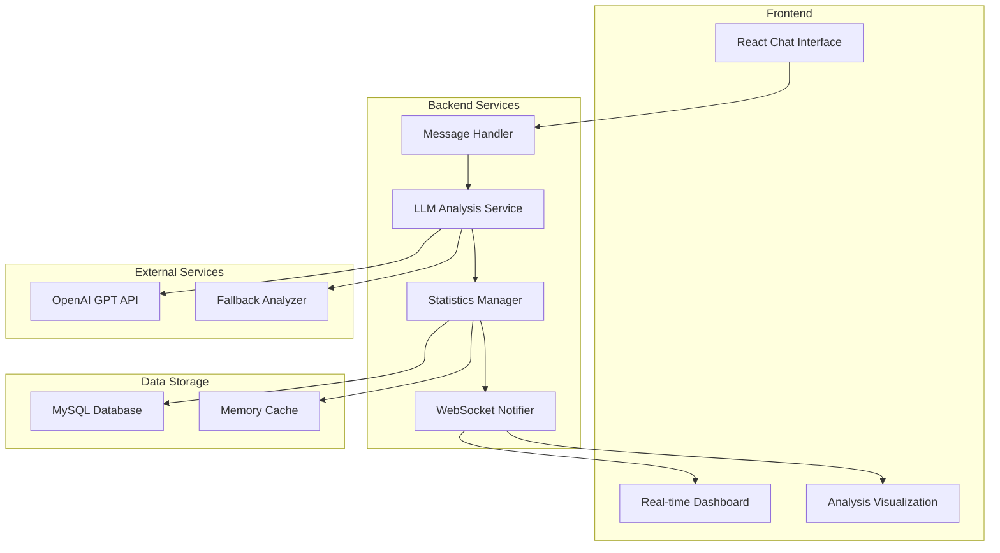
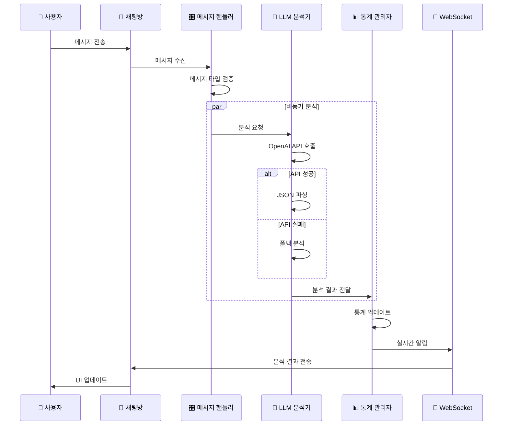

# FlowChat 채팅 분석기z
---

## 프로젝트 소개

### FlowChat이란?
**실시간 채팅 분석을 통한 팀 커뮤니케이션 인사이트 플랫폼**

- **LLM 기반 지능형 분석**: OpenAI GPT를 활용한 메시지 분석
- **다차원 인사이트**: 키워드, 감정, 참여도, 시간 패턴 분석

### 해결하고자 하는 문제
```
기존 아쉬운점
- 팀 대화에서 중요한 주제를 놓치기 쉬움
- 팀원들의 참여도나 분위기 파악이 어려움  
- 시간이 지나면 과거 논의 내용 추적이 힘듦

솔루션
- 실시간으로 핵심 키워드 자동 추출
- 팀원별 참여도와 활동 패턴 시각화
- 기간별 대화 분석 제공
```

---

## 시스템 아키텍처

### 전체 시스템 구조


### 컴포넌트 역할
| 컴포넌트 | 역할 | 주요 기능 |
|---------|------|----------|
| **Message Handler** | 메시지 수신 및 라우팅 | 메시지 검증, 타입 분류, 분석 트리거 |
| **LLM Analysis Service** | 지능형 분석 엔진 | OpenAI API 호출, JSON 파싱, 결과 처리 |
| **Statistics Manager** | 통계 관리자 | 실시간 통계 업데이트, 캐시 관리 |
| **WebSocket Notifier** | 실시간 알림 | 분석 결과 즉시 전송, 구독자 관리 |

---

## 핵심 기능

### 1. 실시간 키워드 분석
```
입력: "프로젝트 일정이 너무 빡빡해서 스트레스 받아요 😰"
    ⬇️
LLM 분석
    ⬇️
출력: 
- 키워드: ["프로젝트", "일정", "스트레스", "업무"]  
- 주제: "업무/문제"
- 감정: "부정적"
- 긴급도: "높음"
```

### 2. 참여도 분석
```
실시간 참여 순위
1. 김개발 ████████████ (47%)
2. 박기획 ████████     (31%) 
3. 이디자인 ████         (15%)
4. 최테스트 ██          (7%)
```

### 3. 시간대별 활동 패턴
```
24시간 활동 히트맵
00 01 02 03 04 05 06 07 08 09 10 11
▁  ▁  ▁  ▁  ▁  ▂  ▃  ▅  ▇  █  ▇  ▅

12 13 14 15 16 17 18 19 20 21 22 23  
▃  ▅  ▇  █  ▇  ▅  ▃  ▂  ▁  ▁  ▁  ▁

인사이트: 오전 9-10시, 오후 3-4시가 소통 피크타임
```

---

## 🔄 동작 원리

### 메시지 처리 플로우


### 분석 단계별 상세 과정

#### 1단계: 메시지 검증
```
분석 대상
- 일반 사용자 메시지
- 텍스트 길이 5자 이상
- 삭제되지 않은 메시지

분석 제외
- 시스템 메시지
- 명령어 메시지  
- 빈 메시지/이모지만 있는 메시지
```

#### 2단계: LLM 분석
```
OpenAI API 요청
{
  "model": "gpt-3.5-turbo",
  "messages": [{
    "role": "system", 
    "content": "채팅 메시지를 분석하여 키워드, 주제, 감정을 JSON으로 추출하세요"
  }, {
    "role": "user",
    "content": "사용자 메시지 내용"
  }]
}

분석 결과
{
  "keywords": ["키워드1", "키워드2", "키워드3"],
  "topic": "업무",
  "sentiment": "부정적",
  "urgency": "높음",
  "confidence": 0.85
}
```

## 사용자 경험

### 실시간 대시보드
```
┌─────────────────────────────────────┐
│ 실시간 키워드                      │
├─────────────────────────────────────┤
│ 프로젝트 ████████ 23회               │
│ 개발    ██████   18회               │
│ 버그    ████     12회               │  
│ 테스트  ███       9회               │
│ 일정    ██        6회               │
└─────────────────────────────────────┘

┌─────────────────────────────────────┐
│ 참여도 순위                        │
├─────────────────────────────────────┤
│ 1. 김개발   ████████████ 47% (23개)  │
│ 2. 박기획   ████████     31% (15개)  │
│ 3. 이디자인 ████         15% (7개)   │
│ 4. 최테스트 ██           7% (3개)    │
└─────────────────────────────────────┘

┌─────────────────────────────────────┐
│ 시간대별 활동                        │
├─────────────────────────────────────┤
│ 09시 ████████████ 15개              │
│ 10시 ██████████   12개              │
│ 14시 ████████     10개              │  
│ 15시 ██████        8개              │
│ 16시 ████          5개              │
└─────────────────────────────────────┘
```


---

## 🎬 데모 시연

### 시나리오: 스타트업 개발팀 하루

#### 오전 9시 - 일일 회의 후
```
💬 채팅방 대화
김개발: "오늘 배포 일정이 빡빡하네요 😅"
박기획: "사용자 테스트 피드백도 반영해야 해서..."  
이디자인: "UI 수정사항 목록 공유드릴게요"

📊 실시간 분석 결과
- 키워드: 배포, 일정, 테스트, 피드백, UI
- 주제: 업무/계획
- 감정: 약간 스트레스 (부정 20%)
- 참여도: 전 팀원 활발
```

#### 오후 2시 - 긴급 이슈 발생
```
💬 채팅방 대화  
최테스트: "서버 에러 발생!! 급해요 🚨"
김개발: "어떤 에러인지 로그 확인 중"
박기획: "사용자들 문의 들어오고 있어요"
이디자인: "긴급 공지 팝업 만들까요?"

📊 실시간 분석 결과
- 🔥 긴급 알림: '에러', '급해요' 키워드 급상승
- 감정 변화: 부정적으로 급변 (-40%)
- 활동 패턴: 모든 팀원 즉시 응답
- 예상 해결 시간: 30분-1시간 (과거 패턴 기반)
```

#### 오후 5시 - 문제 해결 후
```
💬 채팅방 대화
김개발: "서버 복구 완료! 원인은 DB 연결 이슈였어요"  
최테스트: "테스트 결과 모든 기능 정상 동작 확인 ✅"
박기획: "고객 문의도 모두 답변 완료했습니다"
이디자인: "다들 고생 많으셨어요! 🎉"

📊 실시간 분석 결과
- 키워드: 복구, 완료, 정상, 고생
- 감정 회복: 긍정적으로 전환 (+60%)
- 팀워크 지수: 매우 높음 (95%)
- 오늘의 성과: 위기 상황 신속 대응
```

### 주간 분석 리포트 예시
```
📅 이번 주 팀 인사이트 리포트

🏆 주요 성과
- 총 메시지: 1,247개 (전주 대비 +15%)
- 해결된 이슈: 12건
- 팀 협업 점수: 4.3/5.0

📊 팀워크 분석
- 가장 활발한 멤버: 김개발 (28%)
- 균형잡힌 참여도: 전 팀원 20% 이상 기여
- 소통 패턴: 오전 집중, 오후 분산
